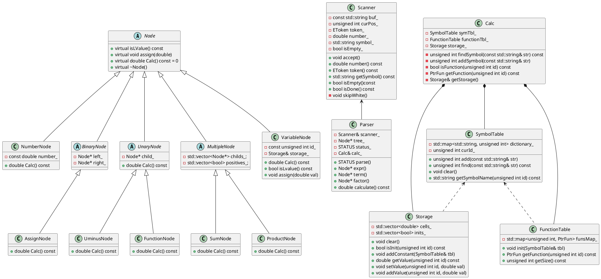

### 类图

```plantuml
@startuml

abstract class Node{
+virtual isLValue() const
+virtual void assign(double)
+virtual double Calc() const = 0
+virtual ~Node()
}

class NumberNode{
+ double Calc() const
- const double number_
}

abstract class BinaryNode{
- Node* left_
- Node* right_
}

abstract class UnaryNode{
+ double Calc() const
- Node* child_
}

abstract class MultipleNode{
-std::vector<Node*> childs_;
-std::vector<bool> positives_;
}

class VariableNode {
+ double Calc() const
+ bool isLvalue() const
+ void assign(double val)
-const unsigned int id_
- Storage& storage_
}

class SumNode{
+ double Calc() const
}

class ProductNode{
+ double Calc() const
}

class UminusNode {
+ double Calc() const
}

class FunctionNode{
+ double Calc() const
}

class AssignNode{
+double Calc() const
}


Node <|-down- NumberNode
Node <|-down- BinaryNode
Node <|-down- UnaryNode
Node <|-down- MultipleNode
Node <|-down- VariableNode

BinaryNode <|-down- AssignNode
MultipleNode <|-down- SumNode
MultipleNode <|-down- ProductNode
UnaryNode <|-down- UminusNode
UnaryNode <|-down- FunctionNode

class Scanner{
+ void accept()
+ double number() const
+ EToken token() const
+ std::string getSymbol() const
+ bool isEmpty()const
+ bool isDone() const
- void skipWhite()
- const std::string buf_
- unsigned int curPos_
- EToken token_
- double number_
- std::string symbol_
- bool isEmpty_
}

class Parser{
+ STATUS parse()
+ Node* expr()
+ Node* term()
+ Node* factor()
+ double calculate() const
- Scanner& scanner_
- Node* tree_
- STATUS status_
- Calc& calc_
}

class SymbolTable{
+ unsigned int add(const std::string& str)
+ unsigned int find(const std::string& str) const
+ void clear()
+ std::string getSymbolName(unsigned int id) const
- std::map<std::string, unsigned int> dictionary_
- unsigned int curId_
}

class Storage{
+ void clear()
+ bool isInit(unsigned int id) const
+ void addConstant(SymbolTable& tbl)
+ double getValue(unsigned int id) const
+ void setValue(unsigned int id, double val)
+ void addValue(unsigned int id, double val)
- std::vector<double> cells_
- std::vector<bool> inits_
}

class FunctionTable{
+ void init(SymbolTable& tbl)
+ PtrFun getFunction(unsigned int id) const
+ unsigned int getSize() const
- std::map<unsigned int, PtrFun> funsMap_
}

class Calc{
- unsigned int findSymbol(const std::string& str) const
- unsigned int addSymbol(const std::string& str)
- bool isFunction(unsigned int id) const
- PtrFun getFunction(unsigned int id) const
- Storage& getStorage()
- SymbolTable symTbl_
- FunctionTable functionTbl_
- Storage storage_
}


Scanner <-down- Parser
Calc *-down- SymbolTable
Calc *-down- Storage
Calc *-down- FunctionTable
SymbolTable <.down. Storage
SymbolTable <.down. FunctionTable
@enduml
```