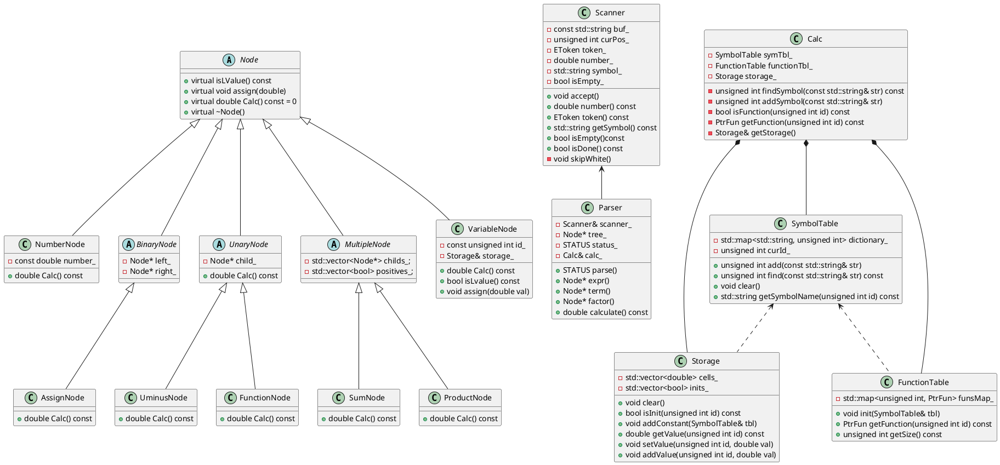

### 类图
![image](//www.plantuml.com/plantuml/png/ZLLVJzi-57tFf_1JbG91lsT-NGLZJ48Q2AajUwmSnoqMZXFPDzqOspxxSkDGtwG9zAMAVV-VUtfywO1Rg78TyTI1vGAOqDmvTbzayZKwtQdQoZLJxjiZrvMCfqmKna6mx0gLiJf2RKsS5LMgvJGO_GMxvbgyHR9FxB_Wy1VhnDFeJnIrTQiybRQjFXGV9MsUrcQQW3Lcw8tmMHbkNtogf1deX6cvWVN-PDNs2OP2Lo5oh0cVGJmfdGrbkAiqg5BBjho3xE9Y9mKKTjP4pdseM__VDQP5eUUiB9m2jPDetaFpoAtYgK_9nXexPPW1zxNhxcjWKQnscKQ9XxCoQ94PKmQOoX2aHTqGtye9S_vZ7NfPLFaxy0I_1rjabO2ZV5UvCfKRduxwVgsC05MOen9VDKEthYEUKLDtzZl9YXyc8JJi6WAf-eRLo3qbGiz45nf58NFm29r7D4zmm3sCMmdwqUemkmTyp4eXtgzTS6EaVTtJIGXPGbp_uxj_HqAxcsNnB0q3_2NN3USTM6MsR2jXyPAdXJvayKrUmaiyxTr-AKnWTk9RSS-g_Fwae3Ri9O8MIQiDShf3Sr7PXyBXDUqIpprnIJgfNDCitj8kruJrt3gFqc9vjLmjM8aN25Ch6_9dQSaHfCt9SSDH2YYgWcjHQGvqwdON4-RyHv0ri5BYgItkW4FLJ8cadpJ9IBCU-YKI4Jlk0CIpB3w04lN0Jlkk6sL6VRiQ9BJaEDq82UvvBkEU6eMfcv2SbpCIUzRfPCuoXSH5HWzj_3QZmtjbU-tr5gXsQnICTUDZ4AHhF7C3CG5pmY3LOOSue7z2ty_cHjpE61NjKFe8vuJH5yPRvan8hHjM73u_oYXmwqErnRa2LkWrEF03s3e21tuB79-P6XeEg5yo7bWtzJjhAypPfhw-uoLf5IcEp_q1DtsZxpEq7yUp3yA217mqQN8yAkJbHM__xMMDe8qgj4nHXRhhOPlsXCQGglE6Hwrsi5chzLwm8WIFdVWxMeiQzXdfPQ-7YFOvEqUFypPisDQDlfGcgtBz3m00)

### plant类图代码

